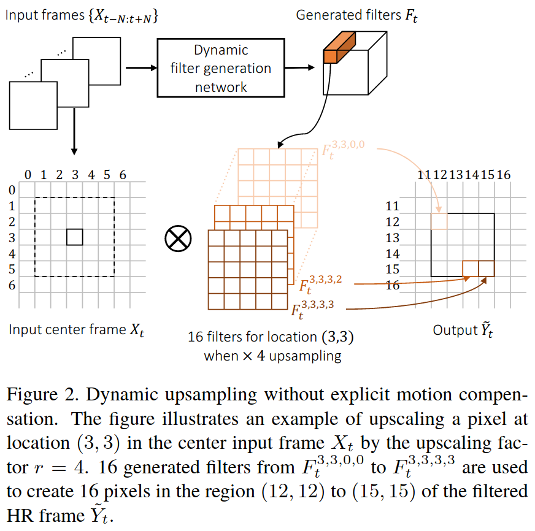
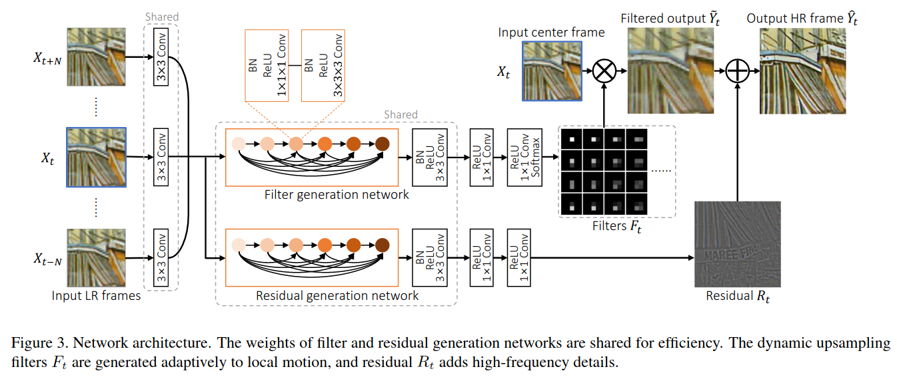
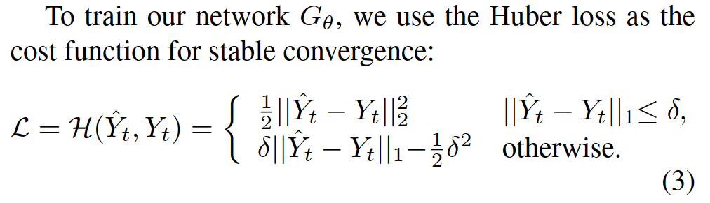
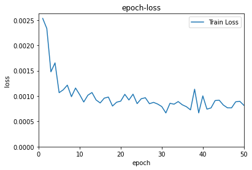
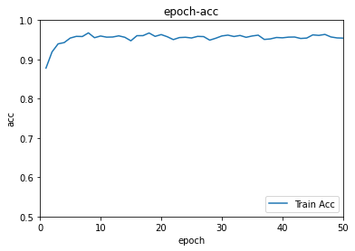
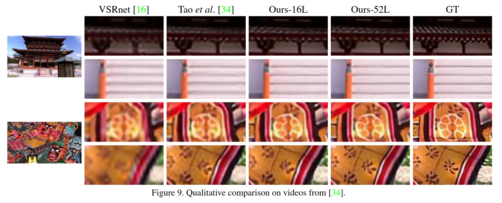

# DUF

# 介绍

这是对论文《[Deep Video Super-Resolution Network Using Dynamic Upsampling Filters Without Explicit Motion Compensation](https://openaccess.thecvf.com/content_cvpr_2018/papers/Jo_Deep_Video_Super-Resolution_CVPR_2018_paper.pdf)》的复现，论文中提出的网络被称为`DUF`，代码使用TensorFlow实现。原文的代码地址如下：[https://github.com/yhjo09/VSR-DUF](https://github.com/yhjo09/VSR-DUF)。

[论文本地下载](./DUF/Jo_Deep_Video_Super-Resolution_CVPR_2018_paper.pdf)

一种耿直的视频超分方法是逐帧超分，但是这样做会失去帧之间的时序关系，导致画面不连贯。

> A straightforward way to perform VSR is to run SISRframe by frame. However, since the SISR methods do notconsider the temporal relationship between frames, there isa high possibility that consecutive frames are not connectednaturally, resulting in the flickering artifact.

所有基于深度学习的VSR方法都有相似的步骤，由两步组成：**一个运动估计和补偿步骤**和**一个上采样步骤**。

> All deep learning based VSR methods follow similar steps and are composed of two steps: a motion estimation and compensation proce-dure followed by an upsampling process [16,22,1,24,34].

这种思路会来带来两个问题，第一是对于运动补偿的高度依赖性，第二是多帧补偿后的LR图像可能会使最后的结果模糊。

> One problem with this two-step approach is that the resultsrely heavily on the accurate motion estimation.  Another potential problem with this type of approach is that the HRoutput frame is produced by mixing the values from multi-ple motion compensated input LR frames through a convo-lutional neural networks (CNN), which can lead to a blurryoutput HR frame.

在本文中，我们提出了一种新的端到端的深度神经网络，它与以往的方法有本质的不同。不需要显式地计算和补偿输入帧之间的运动，而是隐式地利用运动信息生成动态上采样滤波器。利用生成的上采样滤波器，通过对输入中心帧进行局部滤波，直接构造HR帧。由于我们不依赖于运动的显式计算，也不直接组合来自多个帧的值，因此我们可以生成更清晰和一致的HR视频。

> In this paper, we propose a novel end-to-end deep neural network that is fundamentally different from the previous methods. Instead of explicitly computing and compensating for motion between input frames, the motion information is implicitly utilized to generate dynamic upsampling filters. With the generated upsampling filters, the HR frame is directly constructed by local filtering to the input center frame (Fig.2). As we do not rely on explicit computation of motions and do not directly combine values from multiple frames, we can generate much sharper and temporally consistent HR videos.

# 网络架构

## 动态上采样滤波器

文中使用了`DFN（dynamic filter network）`，文章链接：[Dynamic Filter Networks](https://papers.nips.cc/paper/2016/file/8bf1211fd4b7b94528899de0a43b9fb3-Paper.pdf)。DFN可以分为两种类型，本文中使用的是b类型，local filtering，即输入图像每一个像素点都对应一个不同的filter。

首先`N=3`，输入是邻近7帧的图像。DFN的输出是`r^2HW`个滤波器`F_t`，每个滤波器的尺寸是`5x5`，结构如下图所示。滤波器的命名如下：
$$
F_t^{y,x,v,u}
$$
其中，（x，y）对应LR图中的坐标，（u，v）对应HR图对应区域中不同点的坐标。下图中，DFN生成了16个动态滤波核，每个滤波核与LR图像对应像素区域作乘得到HR区域内对应点的坐标。

比如，LR的shape为（6，6，1），需要放大4倍，则DFN生成16（4^2）个滤波核，HR的shape为（24，24，1），原来LR图像中（3，3）坐标对应的是HR图像中（12：15，12：15）区域的像素点。

## 残差学习

动态上采样出来的图片丢失了锐度信息（sharpness），采用多帧融合的残差学习可以补充动态采样的细节。

## 网络设计

本文提出了一种无需特定的运动补偿的动态上采样视频超分网络。网络主要由**动态上采样滤波器生成网络**和**残差网络**组成，前者根据邻近`2N+1`帧来获得动态滤波器，对输入帧进行滤波得到**动态滤波器上采样输出**（shape为HR），后者输出残差图像。两种结果相加得到最后的`Output`结果。

## 损失函数

[Huber loss](https://blog.csdn.net/u013841196/article/details/89923475)

`delta`是一个超参数。

## 网络分析

这是一个`end-to-end`网络，不必像`VESPCN`采用多个损失函数相加。

# 结果

50个epoch之后，模型的表现如图。

对王者荣耀超分的结果已经放在B站和腾讯视频，左边是双线性插值结果，右边是DUF16超分结果，DUF超分结果比双线性插值好一些。[视频链接🔗](https://v.qq.com/x/page/t325055ophw.html)

<iframe src="http://player.bilibili.com/player.html?aid=973404988&bvid=BV1k44y1z7Ea&cid=348729269&page=1" scrolling="no" border="0" frameborder="no" framespacing="0" height="600" allowfullscreen="true"> </iframe>

<iframe height="600" width="100%" src="https://v.qq.com/txp/iframe/player.html?vid=i3250vethx7" scrolling="no" border="0" frameborder="no" framespacing="0" allowfullscreen="true"> </iframe>

DUF效果，如下图所示（摘自paper）。

# 作者

朱文康

如果你有问题，欢迎联系我。我的邮箱是：[1119741654@qq.com](1119741654@qq.com)，乐意回复。

谢谢。

# 参考文献

- [https://www.pianshen.com/article/17201609448/](https://www.pianshen.com/article/17201609448/)
- [学习笔记之——基于深度学习的图像超分辨率重建](https://blog.csdn.net/gwplovekimi/article/details/83041627?utm_medium=distribute.pc_relevant_download.none-task-blog-baidujs-8.nonecase&depth_1-utm_source=distribute.pc_relevant_download.none-task-blog-baidujs-8.nonecase#ESPCN%EF%BC%88Efficient%20Sub-Pixel%20Convolutional%20Neural%20Network%EF%BC%89)
- [计算机视觉--光流法(optical flow)简介](https://blog.csdn.net/qq_41368247/article/details/82562165)
- [回归损失函数：Huber Loss](https://blog.csdn.net/u013841196/article/details/89923475)
- [Dynamic Filter Networks](https://papers.nips.cc/paper/2016/file/8bf1211fd4b7b94528899de0a43b9fb3-Paper.pdf)
- Github: [https://github.com/yhjo09/VSR-DUF](https://github.com/yhjo09/VSR-DUF)

