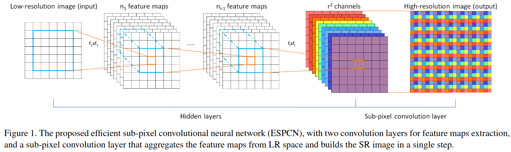
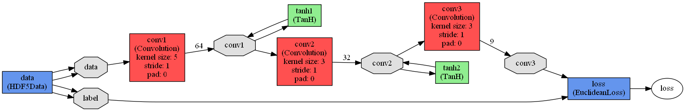
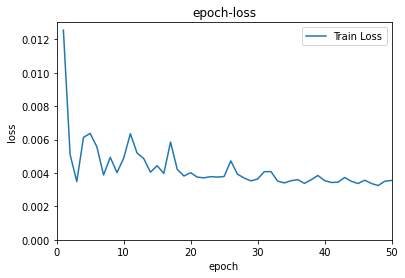
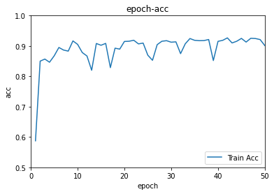
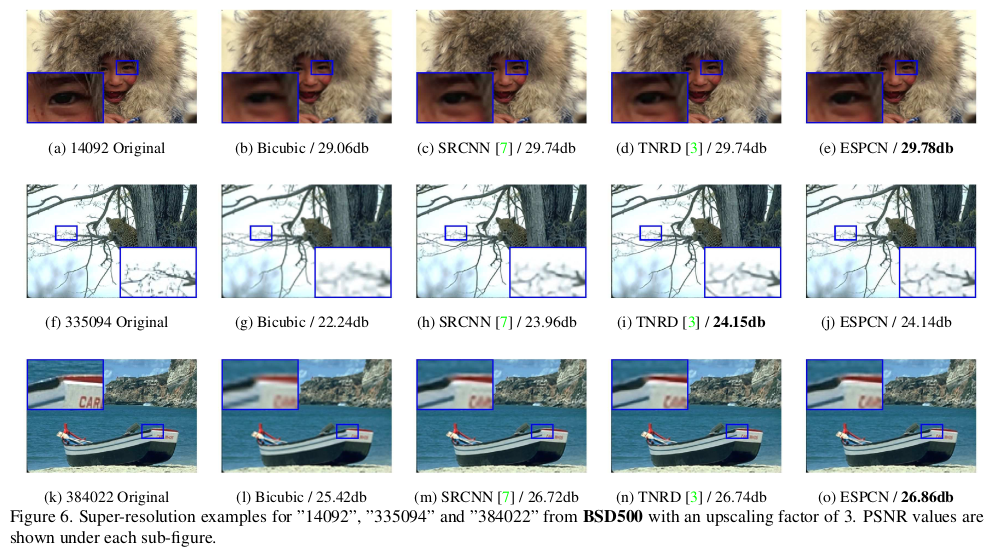

# ESPCN

# Introduction

It is a re-implementation of paper named ["Real-Time Single Image and Video Super-Resolution Using an Efficient Sub-Pixel Convolutional Neural Network"](./ESPCN/Shi_Real-Time_Single_Image_CVPR_2016_paper.pdf) called ESPCN. Training codes and applying codes are provided based tensorflow.

## Network proposed



In this place, $r$ represents the scaling ratio, eg. the input shape of LR is $a * a$ and output shape of HR is $ar * ar$

此处，$r$为放大倍数，如LR输入的shape为$a * a$，则输出shape为$ar * ar$



Processing Flow: Input (LR) -> 5x5 conv -> 3x3 conv -> 3x3 conv -> $r^2$ channels, the channel shape is $a * a$ -> reshape to $ar * ar$ (HR)

处理流程：LR输入 -> 5x5像素卷积 -> 3x3像素卷积 -> 3x3像素卷积 -> $r^2$个channel，每个channel的shape为$a * a$ -> reshape为$ar * ar$


# Pixel Shuffle

## Implementation

TensorFlow has a function which isn't called `Pixel Shuffle`, while it truly works as `Pixel Shuffle`. The layer class is written bellow.

```python
class Shuffler(tf.keras.layers.Layer):
    def __init__(self,r):
        # 调用父类__init__()方法
        super(Shuffler, self).__init__()
        self.r = r

    def call(self, inputs):
        x_c = []
        for c in range(3):
            t = inputs[:,:,:,c*self.r*self.r:c*self.r*self.r+self.r*self.r] # [B,H,W,R*R]
            t = tf.compat.v1.depth_to_space(t, self.r) # [B,H*R,W*R,1]
            x_c += [t]
        x = tf.concat(x_c, axis=3)   # [B,H*R,W*R,3]
        return x
```

The old version of `PixelShuffler`.

```python
class PixelShuffler(tf.keras.layers.Layer):
    def __init__(self, target_shape, **kwargs):
        super(PixelShuffler, self).__init__(**kwargs)
        self.target_shape = tuple(target_shape)
        print("init succeed.")
    
    def build(self,input_shape):
        # self.inshape = input_shape
        print("build succeed.")

    def call(self, inputs,color=True):
        bsize,inh,inw,ind = inputs.shape
        if bsize is None:
                bsize = -1
        h,w,d = self.target_shape
        if ((h%inh!=0) or (w%inw!=0) or (ind%d!=0) or ((h/inh)!=(w/inw)) or ((h/inh)*(w/inw)!=(ind/d))):
            raise Exception("Error! The shape of input and target is not corresponded.")
        r = int(h/inh)
        result = []
        if color:
            Xc = tf.split(inputs, 3, 3)
            for x in Xc:
                X = tf.reshape(x, (bsize, inh, inw, r, r))
                X = tf.transpose(X, (0, 1, 2, 4, 3))  # bsize, a, b, 1, 1
                X = tf.split(X, inh, 1)  # a, [bsize, b, r, r]
                X = tf.concat([tf.squeeze(x) for x in X],2)  # bsize, b, a*r, r
                X = tf.split(X, inw, 1)  # b, [bsize, a*r, r]
                X = tf.concat([tf.squeeze(x) for x in X],2)  # bsize, a*r, b*r
                X = tf.reshape(X, (bsize, inh*r, inw*r, 1))
                result.append(X)
            X = tf.concat(result,3)
        else:
            X = tf.reshape(inputs, (bsize, inh, inw, r, r))
            X = tf.transpose(X, (0, 1, 2, 4, 3))  # bsize, a, b, 1, 1
            X = tf.split(X, 1, inh)  # a, [bsize, b, r, r]
            X = tf.concat([tf.squeeze(x) for x in X],2)  # bsize, b, a*r, r
            X = tf.split(X, 1, inw)  # b, [bsize, a*r, r]
            X = tf.concat([tf.squeeze(x) for x in X],2)  # bsize, a*r, b*r
            X = tf.reshape(X, (bsize, inh*r, inw*r, 1))
            X = tf.concat(result,3)
        print("PixelShuffle Finished.")
        return X
```


# Results

After 50 epoches, the model performs not bad on train data.



The video has been uploaded to `Tencent Video` and `Bilibili`, `Bilibili Link:` [Click me](https://www.bilibili.com/video/BV1cf4y1a7ZV/)

<iframe frameborder="0" height="500" width="100%" src="https://v.qq.com/txp/iframe/player.html?vid=e3250qzey1f" allowFullScreen="true"></iframe>

As the Figure shows below (original from paper), the ESPCN proposed has a better result than other methods about SR problem like Bicubic and SRCNN.




# Author

Wenkang Zhu

If you have or find any problems, this is my email: [1119741654@qq.com](1119741654@qq.com). And I'm glad to reply it.
Thanks. 


# Referrence

- Matlab Implementation on Github: https://github.com/wangxuewen99/Super-Resolution/tree/master/ESPCN
- CSDN Sub-pixel Convolution(子像素卷积): https://blog.csdn.net/leviopku/article/details/84975282
- Cnblog: https://www.cnblogs.com/xiaochouk/p/11337118.html
- Pixel Shuffle Impltmentation: https://blog.csdn.net/bbbeoy/article/details/81085652
- 