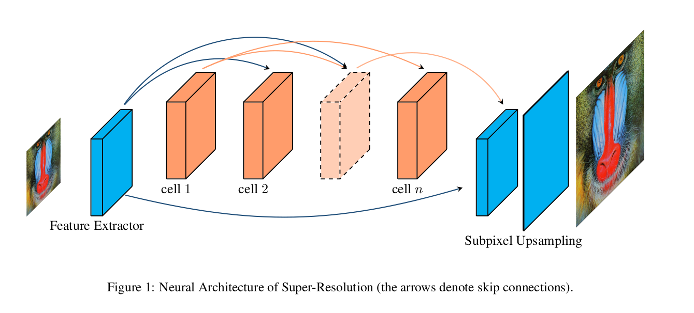
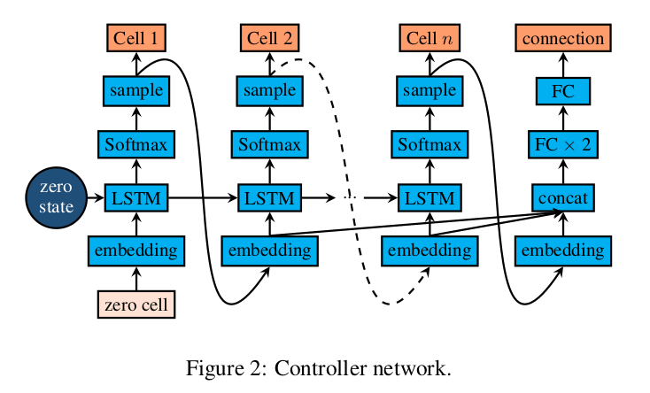
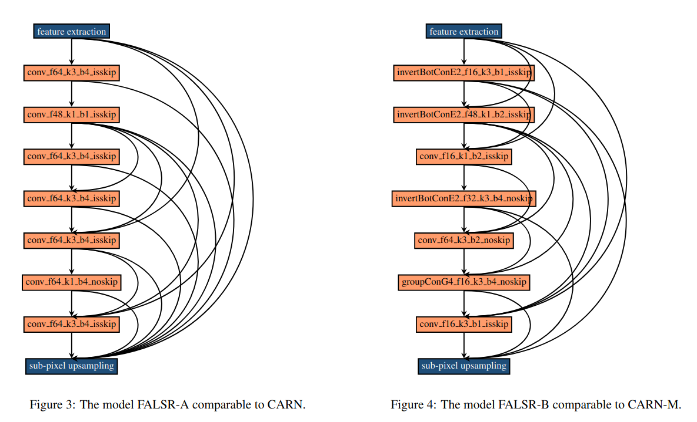
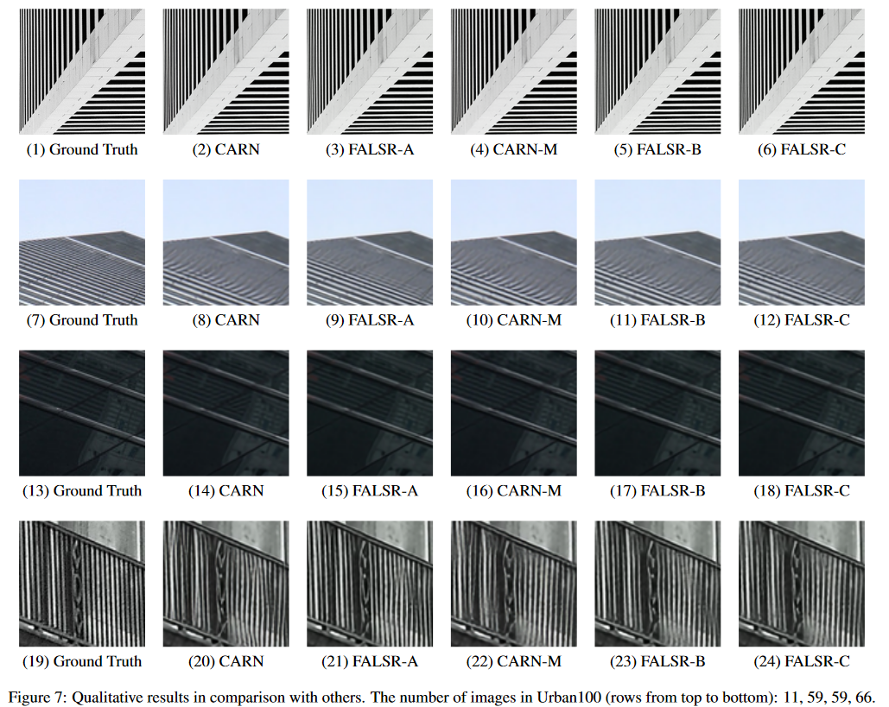

# FALSR

# 介绍

这是对小米公司论文《[Fast, Accurate and Lightweight Super-Resolution with Neural Architecture Search](https://arxiv.org/pdf/1901.07261v2.pdf)》的解读，论文中提出的网络被称为`FALSR`，代码使用TensorFlow实现。原文的测试代码地址如下：[https://github.com/falsr/FALSR](https://github.com/falsr/FALSR)。

因为FALSR是单帧图像超分网络，所以不作实现。

[论文本地下载链接](./FALSR/1901.07261v2.pdf)

# 网络架构

Like most of NAS approaches, our pipeline contains threeprinciple ingredients: an elastic search space（弹性搜索空间）, a hybrid model generator（混合模型生成器） and a model evaluator（模型评估器） based on incomplete training.

## NAS方法

NAS的目标是在特定的搜索空间中寻找最优网络结构和权重，满足最小化训练集损失&最大化验证集Accuracy，实际情况下还会加入计算复杂度如flops或者latency约束。

NAS包含两个核心元素：搜索空间和优化算法。NAS是由基础模块堆叠起来的，一系列的模块堆叠起来构成了搜索空间，优化算法决定最后网络的模块和连接方式。

## 搜索空间构建

通常SR可以被分为三个步骤，特征提取，非线性mapping，重建。FALSR也不例外，它采用了32个`3x3`卷积核的卷积层进行特征提取，`n`个`cell block`进行`nonlinear mapping`，最后进行亚像素上采样（使用了32个`3x3`卷积核，单位步长）。

每一个搜索空间中的`CELL`都包含了若干个2d卷积层，卷积核为1或3，卷积核数量为{16,32,58,64}，可以选择是否残差连接，可以选择`CELL`内重复了几个`Block`。

## 模型生成器

FALSR的模型生成器是一个复合控制器，包含了强化学习（RL）和进化算法（EA）。The EA part handles the iteration process and RL is used to bring exploitation.

## 模型评估

原来打算使用RNN网络来评估，失败了。最后采用了`MSE`，`Mean Square Errors`：均方差。

## 网络分析

这是FALSR的A和B网络架构。

# 结果

如下图所示（摘自paper）

# 作者

朱文康

如果你有问题，欢迎联系我。我的邮箱是：[wenkang_zhu@whu.edu.cn](mailto:wenkang_zhu@whu.edu.cn)，乐意回复。

谢谢。

# 参考文献

1. [https://www.sohu.com/a/327033343_651893](https://www.sohu.com/a/327033343_651893)
2. https://zhuanlan.zhihu.com/p/144386823?utm_source=wechat_timeline&ivk_sa=1024320u 
3. https://baijiahao.baidu.com/s?id=1625992257651364696&wfr=spider&for=pc

