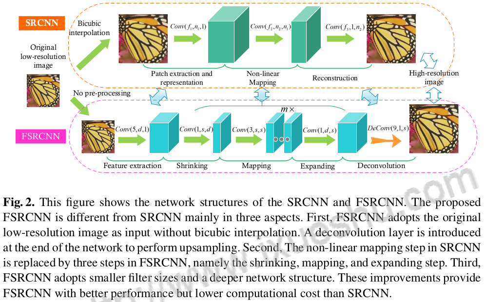

# FSRCNN

# Introduction

It is a re-implementation of paper named ["Accelerating the Super-Resolution Convolutional Neural Network"](./FSRCNN/Accelerating+the+Super-Resolution+Convolutional+Neural+Network.pdf) called FSRCNN model. Training codes and applying codes are provided based tensorflow.

## Network proposed

Here, the three params of $Conv(f,n,c)$ respectively stands for the size of kernel, the number of kernels, the number of tunnels.

The difference between FSRCNN and SRCNN:

- First, FSRCNN adopts the original low-resolution image as input without bicubic interpolation. A deconvolution layer is introduced at the end of the network to perform upsampling. 
- Second, The non-linear mapping step in SRCNN is replaced by three steps in FSRCNN, namely the shrinking, mapping, and expanding step. 
- Third, FSRCNN adopts smaller filter sizes and a deeper network structure.

在此处，$Conv(f,n,c)$的三个参数分别代表了卷积核的大小，卷积核的数量，通道数。

与SRCNN的不同：
- 首先，FSRCNN采用原始低分辨率图像作为输入，无需双三次插值。在网络末端引入反褶积层进行上采样。
- 其次，将SRCNN中的非线性映射步骤替换为FSRCNN中的三个步骤，即收缩、映射和扩展步骤。
= 第三，FSRCNN采用较小的滤波器尺寸和较深的网络结构。

## Analysis of Network

As the table shows below, FSRCNN has less parameters although more layers applied.

# Results

After 50 epoches, the model performs well on train data. Compared with SCRNN, this FSRCNN model shows lower loss (SRCNN:30,FSRCNN:25) and higher accuracy (SRCNN:95%,FSRCNN:95%) on train data. Besides, this model has less parameters than SRCNN. Thus both the training process and prediction process are faster.

The FSRCNN has better performance on SR problem, as the Figure shows below (original from paper).

# Author

Wenkang Zhu

If you have or find any problems, this is my email: [1119741654@qq.com](1119741654@qq.com). And I'm glad to reply it.
Thanks. 

# Reference

1. Github: https://github.com/66wangxuewen99/Super-Resolution/tree/master/FSRCNN