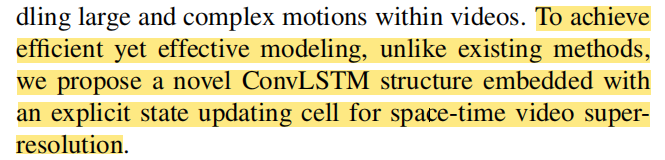
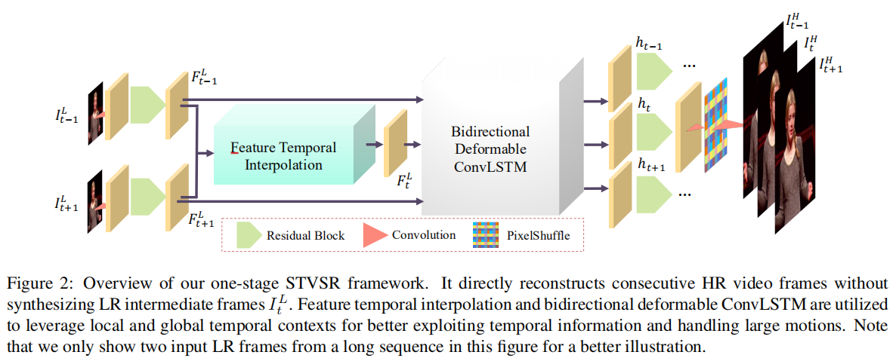
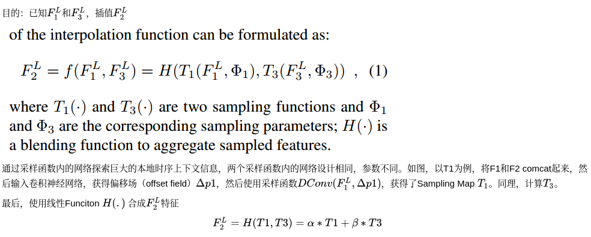
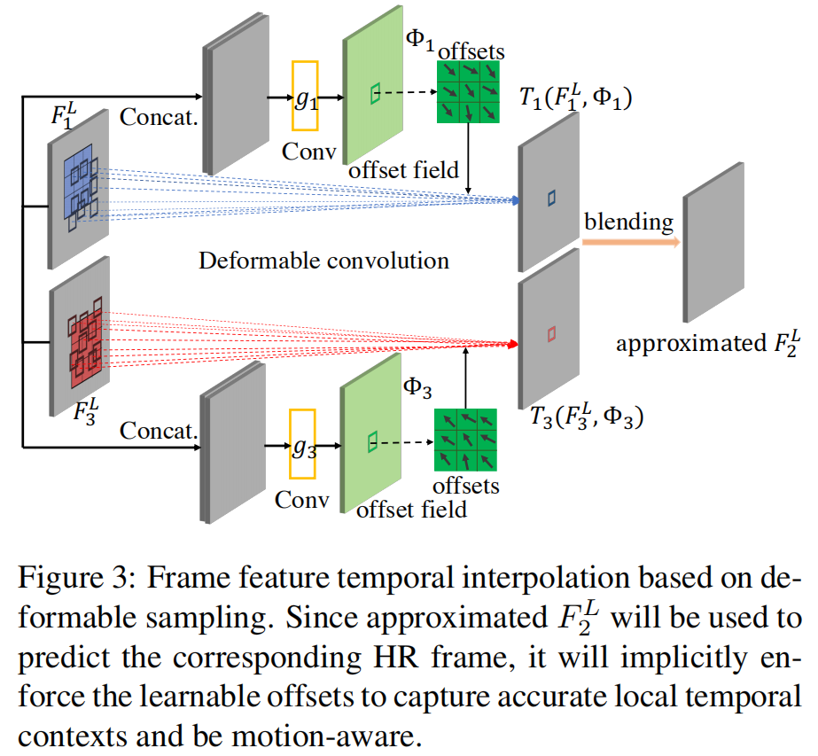
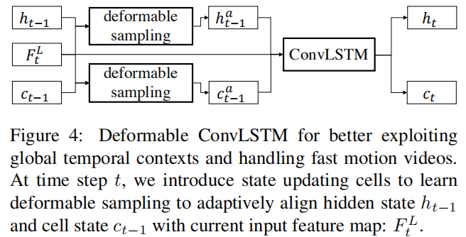
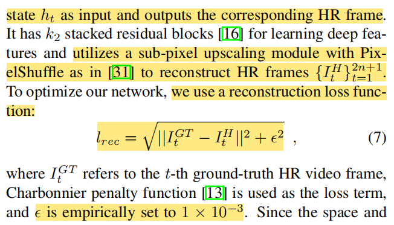

# One-Stage STVSR

# 介绍

文章提出了一种网络可以同时超分和插帧，目标是通过低帧率、低分辨率视频生成高分辨率慢动作视频。一般来说要完成这个task要分为两步，分别使用VFI和VSR网络。但是作者认为这样不能充分利用帧间的自然属性（natural property），此外现流行的VFI和VSR网络需要巨大的帧合成和重建模块。

因此文章提出了一种one-stage的网络来克服这些缺点。

首先，提出了一个特征时序插值网络（feature temporal interpolation network），通过获取本地时序信息来给低分辨率帧的特征插值。

然后，提出了一个可变卷积长短期网络来对齐时序信息。

最后，采用了一个深度重建网络来生成慢动作视频帧。

论文链接1：[2020-Zooming slow-mo fast and accurate one stage space time video super resolution.pdf](https://arxiv.org/pdf/2002.11616.pdf)

论文链接2：[本地链接](./One-Stage-STVSR/2020-Zooming slow-mo fast and accurate one stage space time video super resolution.pdf)

原文的代码地址如下：[https://github.com/Mukosame/Zooming-Slow-Mo-CVPR-2020](https://github.com/Mukosame/Zooming-Slow-Mo-CVPR-2020)。

## 相关工作

VSR的重要问题是如何对齐前后帧。针对这个问题，一些文章使用了光流法（optical flow），但是获得精确的光流很难，而且光流法是人工产品（artifacts）。

为了规避这个问题，DUF和TDAN分别使用了动态卷积核和可变卷积对齐。EDVR在TDAN基础上对多尺度信息进行采样。然而，它们都是`many to one`的model，需要一堆LR帧来预测HR帧，计算低效。

RNN可以缓解sequence-to-sequence learning，它们可以放进VSR问题中来利用时序信息。可是，没有明确的时序对齐，RNN-based VSR网络也没啥用。

因此，文字提出了一种ConvLSTM架构（`many to many`的），嵌入了一种明确的状态更新单元，用来进行时空视频超分。



## 名词解释

1. HR: high-resolution，高分辨率
2. LFR: low frame rate，低帧率
3. LF: low-resolution，低分辨率
4. VFI: video frame interpolation，视频帧插值
5. VSR: video super resolution，视频超分辨率
6. Video Deblur：视频去模糊
7. Temporal Interpolation：时间插值
8. well-posed problem：解存在且唯一
9. ill-posed problem：解可能不存在也可能不唯一
10. inverse problem：反问题，已知输出求输入
11. hidden state：LSTM中负责短期记忆的结构
12. cell state：LSTM中负责长期记忆的结构


# 网络架构

整个网络的结构如下图所示，先通过残差块提取`Feature Maps`，再通过特征时序插值无中生有出中间帧的`Feature Maps`，经过`LSTM`进一步特征提取，然后每一帧的`Feature Maps`都经过残差块得到标准需要的`Feature Maps`形状，最后通过`Pixel Shuffle`重建出三个HR帧。不寻常的有两个地方，分别是特征插值和ConvLSTM模块。



## 帧特征插值（Frame Feature Temporal Interpolation）

为了正确显示公式，下方插入图。





## 双向可变ConvLSTM（Bidirectional Deformable ConvLSTM）

传统的`ConvLSTM`结构接收之前的`hidden`和`cell`状态以及当前`LR`的特征图，输出当前的`hidden`和`cell`状态。但是这种结构对处理大幅度运动的能力有限，如果出现大幅运动，之前的状态反而会对当前`hidden`状态产生严重的时序不匹配的噪声。

所以我们使用可变形对齐（deformable alignment），在`ConvLSTM`前做一个处理，将$h_{t-1}$和$c_{t-1}$进行可变形采样（使用一些卷积）。



## 帧重建（Reconstruction）

使用前述网络的`h_t`作为重建网络的输入，HR作为输出，使用Pixel Shuffle作为尺寸缩放手段，使用的Loss Function如下所示。



## 详细结构

```
LunaTokis(
  (conv_first): Conv2d(3, 64, kernel_size=(3, 3), stride=(1, 1), padding=(1, 1))
  (feature_extraction): Sequential(
    (0): ResidualBlock_noBN(
      (conv1): Conv2d(64, 64, kernel_size=(3, 3), stride=(1, 1), padding=(1, 1))
      (conv2): Conv2d(64, 64, kernel_size=(3, 3), stride=(1, 1), padding=(1, 1))
    )
    (1): ResidualBlock_noBN(
      (conv1): Conv2d(64, 64, kernel_size=(3, 3), stride=(1, 1), padding=(1, 1))
      (conv2): Conv2d(64, 64, kernel_size=(3, 3), stride=(1, 1), padding=(1, 1))
    )
    (2): ResidualBlock_noBN(
      (conv1): Conv2d(64, 64, kernel_size=(3, 3), stride=(1, 1), padding=(1, 1))
      (conv2): Conv2d(64, 64, kernel_size=(3, 3), stride=(1, 1), padding=(1, 1))
    )
    (3): ResidualBlock_noBN(
      (conv1): Conv2d(64, 64, kernel_size=(3, 3), stride=(1, 1), padding=(1, 1))
      (conv2): Conv2d(64, 64, kernel_size=(3, 3), stride=(1, 1), padding=(1, 1))
    )
    (4): ResidualBlock_noBN(
      (conv1): Conv2d(64, 64, kernel_size=(3, 3), stride=(1, 1), padding=(1, 1))
      (conv2): Conv2d(64, 64, kernel_size=(3, 3), stride=(1, 1), padding=(1, 1))
    )
  )
  (fea_L2_conv1): Conv2d(64, 64, kernel_size=(3, 3), stride=(2, 2), padding=(1, 1))
  (fea_L2_conv2): Conv2d(64, 64, kernel_size=(3, 3), stride=(1, 1), padding=(1, 1))
  (fea_L3_conv1): Conv2d(64, 64, kernel_size=(3, 3), stride=(2, 2), padding=(1, 1))
  (fea_L3_conv2): Conv2d(64, 64, kernel_size=(3, 3), stride=(1, 1), padding=(1, 1))
  (pcd_align): PCD_Align(
    (L3_offset_conv1_1): Conv2d(128, 64, kernel_size=(3, 3), stride=(1, 1), padding=(1, 1))
    (L3_offset_conv2_1): Conv2d(64, 64, kernel_size=(3, 3), stride=(1, 1), padding=(1, 1))
    (L3_dcnpack_1): DCN_sep(
      (conv_offset_mask): Conv2d(64, 216, kernel_size=(3, 3), stride=(1, 1), padding=(1, 1))
    )
    (L2_offset_conv1_1): Conv2d(128, 64, kernel_size=(3, 3), stride=(1, 1), padding=(1, 1))
    (L2_offset_conv2_1): Conv2d(128, 64, kernel_size=(3, 3), stride=(1, 1), padding=(1, 1))
    (L2_offset_conv3_1): Conv2d(64, 64, kernel_size=(3, 3), stride=(1, 1), padding=(1, 1))
    (L2_dcnpack_1): DCN_sep(
      (conv_offset_mask): Conv2d(64, 216, kernel_size=(3, 3), stride=(1, 1), padding=(1, 1))
    )
    (L2_fea_conv_1): Conv2d(128, 64, kernel_size=(3, 3), stride=(1, 1), padding=(1, 1))
    (L1_offset_conv1_1): Conv2d(128, 64, kernel_size=(3, 3), stride=(1, 1), padding=(1, 1))
    (L1_offset_conv2_1): Conv2d(128, 64, kernel_size=(3, 3), stride=(1, 1), padding=(1, 1))
    (L1_offset_conv3_1): Conv2d(64, 64, kernel_size=(3, 3), stride=(1, 1), padding=(1, 1))
    (L1_dcnpack_1): DCN_sep(
      (conv_offset_mask): Conv2d(64, 216, kernel_size=(3, 3), stride=(1, 1), padding=(1, 1))
    )
    (L1_fea_conv_1): Conv2d(128, 64, kernel_size=(3, 3), stride=(1, 1), padding=(1, 1))
    (L3_offset_conv1_2): Conv2d(128, 64, kernel_size=(3, 3), stride=(1, 1), padding=(1, 1))
    (L3_offset_conv2_2): Conv2d(64, 64, kernel_size=(3, 3), stride=(1, 1), padding=(1, 1))
    (L3_dcnpack_2): DCN_sep(
      (conv_offset_mask): Conv2d(64, 216, kernel_size=(3, 3), stride=(1, 1), padding=(1, 1))
    )
    (L2_offset_conv1_2): Conv2d(128, 64, kernel_size=(3, 3), stride=(1, 1), padding=(1, 1))
    (L2_offset_conv2_2): Conv2d(128, 64, kernel_size=(3, 3), stride=(1, 1), padding=(1, 1))
    (L2_offset_conv3_2): Conv2d(64, 64, kernel_size=(3, 3), stride=(1, 1), padding=(1, 1))
    (L2_dcnpack_2): DCN_sep(
      (conv_offset_mask): Conv2d(64, 216, kernel_size=(3, 3), stride=(1, 1), padding=(1, 1))
    )
    (L2_fea_conv_2): Conv2d(128, 64, kernel_size=(3, 3), stride=(1, 1), padding=(1, 1))
    (L1_offset_conv1_2): Conv2d(128, 64, kernel_size=(3, 3), stride=(1, 1), padding=(1, 1))
    (L1_offset_conv2_2): Conv2d(128, 64, kernel_size=(3, 3), stride=(1, 1), padding=(1, 1))
    (L1_offset_conv3_2): Conv2d(64, 64, kernel_size=(3, 3), stride=(1, 1), padding=(1, 1))
    (L1_dcnpack_2): DCN_sep(
      (conv_offset_mask): Conv2d(64, 216, kernel_size=(3, 3), stride=(1, 1), padding=(1, 1))
    )
    (L1_fea_conv_2): Conv2d(128, 64, kernel_size=(3, 3), stride=(1, 1), padding=(1, 1))
    (lrelu): LeakyReLU(negative_slope=0.1, inplace=True)
  )
  (fusion): Conv2d(128, 64, kernel_size=(1, 1), stride=(1, 1))
  (ConvBLSTM): BiDeformableConvLSTM(
    (forward_net): DeformableConvLSTM(
      (cell_list): ModuleList(
        (0): ConvLSTMCell(
          (conv): Conv2d(128, 256, kernel_size=(3, 3), stride=(1, 1), padding=(1, 1))
        )
      )
      (pcd_h): Easy_PCD(
        (fea_L2_conv1): Conv2d(64, 64, kernel_size=(3, 3), stride=(2, 2), padding=(1, 1))
        (fea_L2_conv2): Conv2d(64, 64, kernel_size=(3, 3), stride=(1, 1), padding=(1, 1))
        (fea_L3_conv1): Conv2d(64, 64, kernel_size=(3, 3), stride=(2, 2), padding=(1, 1))
        (fea_L3_conv2): Conv2d(64, 64, kernel_size=(3, 3), stride=(1, 1), padding=(1, 1))
        (pcd_align): PCD_Align(
          (L3_offset_conv1_1): Conv2d(128, 64, kernel_size=(3, 3), stride=(1, 1), padding=(1, 1))
          (L3_offset_conv2_1): Conv2d(64, 64, kernel_size=(3, 3), stride=(1, 1), padding=(1, 1))
          (L3_dcnpack_1): DCN_sep(
            (conv_offset_mask): Conv2d(64, 216, kernel_size=(3, 3), stride=(1, 1), padding=(1, 1))
          )
          (L2_offset_conv1_1): Conv2d(128, 64, kernel_size=(3, 3), stride=(1, 1), padding=(1, 1))
          (L2_offset_conv2_1): Conv2d(128, 64, kernel_size=(3, 3), stride=(1, 1), padding=(1, 1))
          (L2_offset_conv3_1): Conv2d(64, 64, kernel_size=(3, 3), stride=(1, 1), padding=(1, 1))
          (L2_dcnpack_1): DCN_sep(
            (conv_offset_mask): Conv2d(64, 216, kernel_size=(3, 3), stride=(1, 1), padding=(1, 1))
          )
          (L2_fea_conv_1): Conv2d(128, 64, kernel_size=(3, 3), stride=(1, 1), padding=(1, 1))
          (L1_offset_conv1_1): Conv2d(128, 64, kernel_size=(3, 3), stride=(1, 1), padding=(1, 1))
          (L1_offset_conv2_1): Conv2d(128, 64, kernel_size=(3, 3), stride=(1, 1), padding=(1, 1))
          (L1_offset_conv3_1): Conv2d(64, 64, kernel_size=(3, 3), stride=(1, 1), padding=(1, 1))
          (L1_dcnpack_1): DCN_sep(
            (conv_offset_mask): Conv2d(64, 216, kernel_size=(3, 3), stride=(1, 1), padding=(1, 1))
          )
          (L1_fea_conv_1): Conv2d(128, 64, kernel_size=(3, 3), stride=(1, 1), padding=(1, 1))
          (L3_offset_conv1_2): Conv2d(128, 64, kernel_size=(3, 3), stride=(1, 1), padding=(1, 1))
          (L3_offset_conv2_2): Conv2d(64, 64, kernel_size=(3, 3), stride=(1, 1), padding=(1, 1))
          (L3_dcnpack_2): DCN_sep(
            (conv_offset_mask): Conv2d(64, 216, kernel_size=(3, 3), stride=(1, 1), padding=(1, 1))
          )
          (L2_offset_conv1_2): Conv2d(128, 64, kernel_size=(3, 3), stride=(1, 1), padding=(1, 1))
          (L2_offset_conv2_2): Conv2d(128, 64, kernel_size=(3, 3), stride=(1, 1), padding=(1, 1))
          (L2_offset_conv3_2): Conv2d(64, 64, kernel_size=(3, 3), stride=(1, 1), padding=(1, 1))
          (L2_dcnpack_2): DCN_sep(
            (conv_offset_mask): Conv2d(64, 216, kernel_size=(3, 3), stride=(1, 1), padding=(1, 1))
          )
          (L2_fea_conv_2): Conv2d(128, 64, kernel_size=(3, 3), stride=(1, 1), padding=(1, 1))
          (L1_offset_conv1_2): Conv2d(128, 64, kernel_size=(3, 3), stride=(1, 1), padding=(1, 1))
          (L1_offset_conv2_2): Conv2d(128, 64, kernel_size=(3, 3), stride=(1, 1), padding=(1, 1))
          (L1_offset_conv3_2): Conv2d(64, 64, kernel_size=(3, 3), stride=(1, 1), padding=(1, 1))
          (L1_dcnpack_2): DCN_sep(
            (conv_offset_mask): Conv2d(64, 216, kernel_size=(3, 3), stride=(1, 1), padding=(1, 1))
          )
          (L1_fea_conv_2): Conv2d(128, 64, kernel_size=(3, 3), stride=(1, 1), padding=(1, 1))
          (lrelu): LeakyReLU(negative_slope=0.1, inplace=True)
        )
        (fusion): Conv2d(128, 64, kernel_size=(1, 1), stride=(1, 1))
        (lrelu): LeakyReLU(negative_slope=0.1, inplace=True)
      )
      (pcd_c): Easy_PCD(
        (fea_L2_conv1): Conv2d(64, 64, kernel_size=(3, 3), stride=(2, 2), padding=(1, 1))
        (fea_L2_conv2): Conv2d(64, 64, kernel_size=(3, 3), stride=(1, 1), padding=(1, 1))
        (fea_L3_conv1): Conv2d(64, 64, kernel_size=(3, 3), stride=(2, 2), padding=(1, 1))
        (fea_L3_conv2): Conv2d(64, 64, kernel_size=(3, 3), stride=(1, 1), padding=(1, 1))
        (pcd_align): PCD_Align(
          (L3_offset_conv1_1): Conv2d(128, 64, kernel_size=(3, 3), stride=(1, 1), padding=(1, 1))
          (L3_offset_conv2_1): Conv2d(64, 64, kernel_size=(3, 3), stride=(1, 1), padding=(1, 1))
          (L3_dcnpack_1): DCN_sep(
            (conv_offset_mask): Conv2d(64, 216, kernel_size=(3, 3), stride=(1, 1), padding=(1, 1))
          )
          (L2_offset_conv1_1): Conv2d(128, 64, kernel_size=(3, 3), stride=(1, 1), padding=(1, 1))
          (L2_offset_conv2_1): Conv2d(128, 64, kernel_size=(3, 3), stride=(1, 1), padding=(1, 1))
          (L2_offset_conv3_1): Conv2d(64, 64, kernel_size=(3, 3), stride=(1, 1), padding=(1, 1))
          (L2_dcnpack_1): DCN_sep(
            (conv_offset_mask): Conv2d(64, 216, kernel_size=(3, 3), stride=(1, 1), padding=(1, 1))
          )
          (L2_fea_conv_1): Conv2d(128, 64, kernel_size=(3, 3), stride=(1, 1), padding=(1, 1))
          (L1_offset_conv1_1): Conv2d(128, 64, kernel_size=(3, 3), stride=(1, 1), padding=(1, 1))
          (L1_offset_conv2_1): Conv2d(128, 64, kernel_size=(3, 3), stride=(1, 1), padding=(1, 1))
          (L1_offset_conv3_1): Conv2d(64, 64, kernel_size=(3, 3), stride=(1, 1), padding=(1, 1))
          (L1_dcnpack_1): DCN_sep(
            (conv_offset_mask): Conv2d(64, 216, kernel_size=(3, 3), stride=(1, 1), padding=(1, 1))
          )
          (L1_fea_conv_1): Conv2d(128, 64, kernel_size=(3, 3), stride=(1, 1), padding=(1, 1))
          (L3_offset_conv1_2): Conv2d(128, 64, kernel_size=(3, 3), stride=(1, 1), padding=(1, 1))
          (L3_offset_conv2_2): Conv2d(64, 64, kernel_size=(3, 3), stride=(1, 1), padding=(1, 1))
          (L3_dcnpack_2): DCN_sep(
            (conv_offset_mask): Conv2d(64, 216, kernel_size=(3, 3), stride=(1, 1), padding=(1, 1))
          )
          (L2_offset_conv1_2): Conv2d(128, 64, kernel_size=(3, 3), stride=(1, 1), padding=(1, 1))
          (L2_offset_conv2_2): Conv2d(128, 64, kernel_size=(3, 3), stride=(1, 1), padding=(1, 1))
          (L2_offset_conv3_2): Conv2d(64, 64, kernel_size=(3, 3), stride=(1, 1), padding=(1, 1))
          (L2_dcnpack_2): DCN_sep(
            (conv_offset_mask): Conv2d(64, 216, kernel_size=(3, 3), stride=(1, 1), padding=(1, 1))
          )
          (L2_fea_conv_2): Conv2d(128, 64, kernel_size=(3, 3), stride=(1, 1), padding=(1, 1))
          (L1_offset_conv1_2): Conv2d(128, 64, kernel_size=(3, 3), stride=(1, 1), padding=(1, 1))
          (L1_offset_conv2_2): Conv2d(128, 64, kernel_size=(3, 3), stride=(1, 1), padding=(1, 1))
          (L1_offset_conv3_2): Conv2d(64, 64, kernel_size=(3, 3), stride=(1, 1), padding=(1, 1))
          (L1_dcnpack_2): DCN_sep(
            (conv_offset_mask): Conv2d(64, 216, kernel_size=(3, 3), stride=(1, 1), padding=(1, 1))
          )
          (L1_fea_conv_2): Conv2d(128, 64, kernel_size=(3, 3), stride=(1, 1), padding=(1, 1))
          (lrelu): LeakyReLU(negative_slope=0.1, inplace=True)
        )
        (fusion): Conv2d(128, 64, kernel_size=(1, 1), stride=(1, 1))
        (lrelu): LeakyReLU(negative_slope=0.1, inplace=True)
      )
      (lrelu): LeakyReLU(negative_slope=0.1, inplace=True)
    )
    (conv_1x1): Conv2d(128, 64, kernel_size=(1, 1), stride=(1, 1))
  )
  (recon_trunk): Sequential(
    (0): ResidualBlock_noBN(
      (conv1): Conv2d(64, 64, kernel_size=(3, 3), stride=(1, 1), padding=(1, 1))
      (conv2): Conv2d(64, 64, kernel_size=(3, 3), stride=(1, 1), padding=(1, 1))
    )
    (1): ResidualBlock_noBN(
      (conv1): Conv2d(64, 64, kernel_size=(3, 3), stride=(1, 1), padding=(1, 1))
      (conv2): Conv2d(64, 64, kernel_size=(3, 3), stride=(1, 1), padding=(1, 1))
    )
    (2): ResidualBlock_noBN(
      (conv1): Conv2d(64, 64, kernel_size=(3, 3), stride=(1, 1), padding=(1, 1))
      (conv2): Conv2d(64, 64, kernel_size=(3, 3), stride=(1, 1), padding=(1, 1))
    )
    (3): ResidualBlock_noBN(
      (conv1): Conv2d(64, 64, kernel_size=(3, 3), stride=(1, 1), padding=(1, 1))
      (conv2): Conv2d(64, 64, kernel_size=(3, 3), stride=(1, 1), padding=(1, 1))
    )
    (4): ResidualBlock_noBN(
      (conv1): Conv2d(64, 64, kernel_size=(3, 3), stride=(1, 1), padding=(1, 1))
      (conv2): Conv2d(64, 64, kernel_size=(3, 3), stride=(1, 1), padding=(1, 1))
    )
    (5): ResidualBlock_noBN(
      (conv1): Conv2d(64, 64, kernel_size=(3, 3), stride=(1, 1), padding=(1, 1))
      (conv2): Conv2d(64, 64, kernel_size=(3, 3), stride=(1, 1), padding=(1, 1))
    )
    (6): ResidualBlock_noBN(
      (conv1): Conv2d(64, 64, kernel_size=(3, 3), stride=(1, 1), padding=(1, 1))
      (conv2): Conv2d(64, 64, kernel_size=(3, 3), stride=(1, 1), padding=(1, 1))
    )
    (7): ResidualBlock_noBN(
      (conv1): Conv2d(64, 64, kernel_size=(3, 3), stride=(1, 1), padding=(1, 1))
      (conv2): Conv2d(64, 64, kernel_size=(3, 3), stride=(1, 1), padding=(1, 1))
    )
    (8): ResidualBlock_noBN(
      (conv1): Conv2d(64, 64, kernel_size=(3, 3), stride=(1, 1), padding=(1, 1))
      (conv2): Conv2d(64, 64, kernel_size=(3, 3), stride=(1, 1), padding=(1, 1))
    )
    (9): ResidualBlock_noBN(
      (conv1): Conv2d(64, 64, kernel_size=(3, 3), stride=(1, 1), padding=(1, 1))
      (conv2): Conv2d(64, 64, kernel_size=(3, 3), stride=(1, 1), padding=(1, 1))
    )
    (10): ResidualBlock_noBN(
      (conv1): Conv2d(64, 64, kernel_size=(3, 3), stride=(1, 1), padding=(1, 1))
      (conv2): Conv2d(64, 64, kernel_size=(3, 3), stride=(1, 1), padding=(1, 1))
    )
    (11): ResidualBlock_noBN(
      (conv1): Conv2d(64, 64, kernel_size=(3, 3), stride=(1, 1), padding=(1, 1))
      (conv2): Conv2d(64, 64, kernel_size=(3, 3), stride=(1, 1), padding=(1, 1))
    )
    (12): ResidualBlock_noBN(
      (conv1): Conv2d(64, 64, kernel_size=(3, 3), stride=(1, 1), padding=(1, 1))
      (conv2): Conv2d(64, 64, kernel_size=(3, 3), stride=(1, 1), padding=(1, 1))
    )
    (13): ResidualBlock_noBN(
      (conv1): Conv2d(64, 64, kernel_size=(3, 3), stride=(1, 1), padding=(1, 1))
      (conv2): Conv2d(64, 64, kernel_size=(3, 3), stride=(1, 1), padding=(1, 1))
    )
    (14): ResidualBlock_noBN(
      (conv1): Conv2d(64, 64, kernel_size=(3, 3), stride=(1, 1), padding=(1, 1))
      (conv2): Conv2d(64, 64, kernel_size=(3, 3), stride=(1, 1), padding=(1, 1))
    )
    (15): ResidualBlock_noBN(
      (conv1): Conv2d(64, 64, kernel_size=(3, 3), stride=(1, 1), padding=(1, 1))
      (conv2): Conv2d(64, 64, kernel_size=(3, 3), stride=(1, 1), padding=(1, 1))
    )
    (16): ResidualBlock_noBN(
      (conv1): Conv2d(64, 64, kernel_size=(3, 3), stride=(1, 1), padding=(1, 1))
      (conv2): Conv2d(64, 64, kernel_size=(3, 3), stride=(1, 1), padding=(1, 1))
    )
    (17): ResidualBlock_noBN(
      (conv1): Conv2d(64, 64, kernel_size=(3, 3), stride=(1, 1), padding=(1, 1))
      (conv2): Conv2d(64, 64, kernel_size=(3, 3), stride=(1, 1), padding=(1, 1))
    )
    (18): ResidualBlock_noBN(
      (conv1): Conv2d(64, 64, kernel_size=(3, 3), stride=(1, 1), padding=(1, 1))
      (conv2): Conv2d(64, 64, kernel_size=(3, 3), stride=(1, 1), padding=(1, 1))
    )
    (19): ResidualBlock_noBN(
      (conv1): Conv2d(64, 64, kernel_size=(3, 3), stride=(1, 1), padding=(1, 1))
      (conv2): Conv2d(64, 64, kernel_size=(3, 3), stride=(1, 1), padding=(1, 1))
    )
    (20): ResidualBlock_noBN(
      (conv1): Conv2d(64, 64, kernel_size=(3, 3), stride=(1, 1), padding=(1, 1))
      (conv2): Conv2d(64, 64, kernel_size=(3, 3), stride=(1, 1), padding=(1, 1))
    )
    (21): ResidualBlock_noBN(
      (conv1): Conv2d(64, 64, kernel_size=(3, 3), stride=(1, 1), padding=(1, 1))
      (conv2): Conv2d(64, 64, kernel_size=(3, 3), stride=(1, 1), padding=(1, 1))
    )
    (22): ResidualBlock_noBN(
      (conv1): Conv2d(64, 64, kernel_size=(3, 3), stride=(1, 1), padding=(1, 1))
      (conv2): Conv2d(64, 64, kernel_size=(3, 3), stride=(1, 1), padding=(1, 1))
    )
    (23): ResidualBlock_noBN(
      (conv1): Conv2d(64, 64, kernel_size=(3, 3), stride=(1, 1), padding=(1, 1))
      (conv2): Conv2d(64, 64, kernel_size=(3, 3), stride=(1, 1), padding=(1, 1))
    )
    (24): ResidualBlock_noBN(
      (conv1): Conv2d(64, 64, kernel_size=(3, 3), stride=(1, 1), padding=(1, 1))
      (conv2): Conv2d(64, 64, kernel_size=(3, 3), stride=(1, 1), padding=(1, 1))
    )
    (25): ResidualBlock_noBN(
      (conv1): Conv2d(64, 64, kernel_size=(3, 3), stride=(1, 1), padding=(1, 1))
      (conv2): Conv2d(64, 64, kernel_size=(3, 3), stride=(1, 1), padding=(1, 1))
    )
    (26): ResidualBlock_noBN(
      (conv1): Conv2d(64, 64, kernel_size=(3, 3), stride=(1, 1), padding=(1, 1))
      (conv2): Conv2d(64, 64, kernel_size=(3, 3), stride=(1, 1), padding=(1, 1))
    )
    (27): ResidualBlock_noBN(
      (conv1): Conv2d(64, 64, kernel_size=(3, 3), stride=(1, 1), padding=(1, 1))
      (conv2): Conv2d(64, 64, kernel_size=(3, 3), stride=(1, 1), padding=(1, 1))
    )
    (28): ResidualBlock_noBN(
      (conv1): Conv2d(64, 64, kernel_size=(3, 3), stride=(1, 1), padding=(1, 1))
      (conv2): Conv2d(64, 64, kernel_size=(3, 3), stride=(1, 1), padding=(1, 1))
    )
    (29): ResidualBlock_noBN(
      (conv1): Conv2d(64, 64, kernel_size=(3, 3), stride=(1, 1), padding=(1, 1))
      (conv2): Conv2d(64, 64, kernel_size=(3, 3), stride=(1, 1), padding=(1, 1))
    )
    (30): ResidualBlock_noBN(
      (conv1): Conv2d(64, 64, kernel_size=(3, 3), stride=(1, 1), padding=(1, 1))
      (conv2): Conv2d(64, 64, kernel_size=(3, 3), stride=(1, 1), padding=(1, 1))
    )
    (31): ResidualBlock_noBN(
      (conv1): Conv2d(64, 64, kernel_size=(3, 3), stride=(1, 1), padding=(1, 1))
      (conv2): Conv2d(64, 64, kernel_size=(3, 3), stride=(1, 1), padding=(1, 1))
    )
    (32): ResidualBlock_noBN(
      (conv1): Conv2d(64, 64, kernel_size=(3, 3), stride=(1, 1), padding=(1, 1))
      (conv2): Conv2d(64, 64, kernel_size=(3, 3), stride=(1, 1), padding=(1, 1))
    )
    (33): ResidualBlock_noBN(
      (conv1): Conv2d(64, 64, kernel_size=(3, 3), stride=(1, 1), padding=(1, 1))
      (conv2): Conv2d(64, 64, kernel_size=(3, 3), stride=(1, 1), padding=(1, 1))
    )
    (34): ResidualBlock_noBN(
      (conv1): Conv2d(64, 64, kernel_size=(3, 3), stride=(1, 1), padding=(1, 1))
      (conv2): Conv2d(64, 64, kernel_size=(3, 3), stride=(1, 1), padding=(1, 1))
    )
    (35): ResidualBlock_noBN(
      (conv1): Conv2d(64, 64, kernel_size=(3, 3), stride=(1, 1), padding=(1, 1))
      (conv2): Conv2d(64, 64, kernel_size=(3, 3), stride=(1, 1), padding=(1, 1))
    )
    (36): ResidualBlock_noBN(
      (conv1): Conv2d(64, 64, kernel_size=(3, 3), stride=(1, 1), padding=(1, 1))
      (conv2): Conv2d(64, 64, kernel_size=(3, 3), stride=(1, 1), padding=(1, 1))
    )
    (37): ResidualBlock_noBN(
      (conv1): Conv2d(64, 64, kernel_size=(3, 3), stride=(1, 1), padding=(1, 1))
      (conv2): Conv2d(64, 64, kernel_size=(3, 3), stride=(1, 1), padding=(1, 1))
    )
    (38): ResidualBlock_noBN(
      (conv1): Conv2d(64, 64, kernel_size=(3, 3), stride=(1, 1), padding=(1, 1))
      (conv2): Conv2d(64, 64, kernel_size=(3, 3), stride=(1, 1), padding=(1, 1))
    )
    (39): ResidualBlock_noBN(
      (conv1): Conv2d(64, 64, kernel_size=(3, 3), stride=(1, 1), padding=(1, 1))
      (conv2): Conv2d(64, 64, kernel_size=(3, 3), stride=(1, 1), padding=(1, 1))
    )
  )
  (upconv1): Conv2d(64, 256, kernel_size=(3, 3), stride=(1, 1), padding=(1, 1))
  (upconv2): Conv2d(64, 256, kernel_size=(3, 3), stride=(1, 1), padding=(1, 1))
  (pixel_shuffle): PixelShuffle(upscale_factor=2)
  (HRconv): Conv2d(64, 64, kernel_size=(3, 3), stride=(1, 1), padding=(1, 1))
  (conv_last): Conv2d(64, 3, kernel_size=(3, 3), stride=(1, 1), padding=(1, 1))
  (lrelu): LeakyReLU(negative_slope=0.1, inplace=True)
)
```


# 结果

<iframe frameborder="0" src="https://v.qq.com/txp/iframe/player.html?vid=e3250valjad" height="600" width="100%" allowFullScreen="true"></iframe>


# 作者

朱文康

如果你有问题，欢迎联系我。我的邮箱是：[wenkang_zhu@whu.edu.cn](mailto:wenkang_zhu@whu.edu.cn)，乐意回复。

谢谢。


# 参考文献

- 
