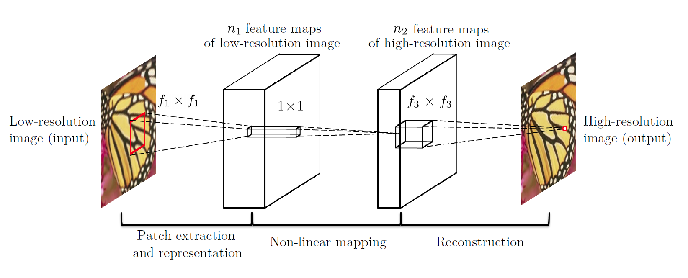
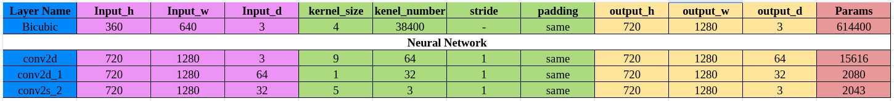
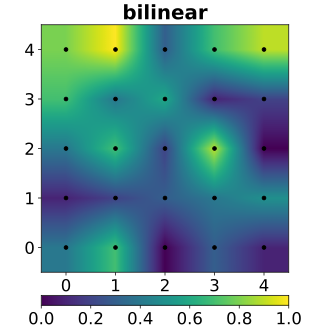
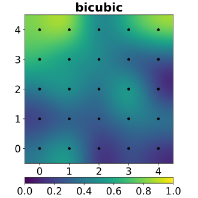
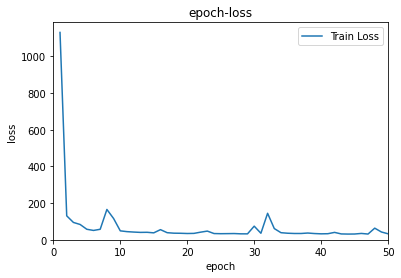
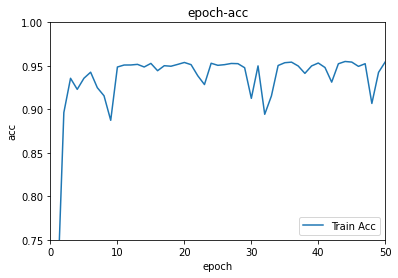
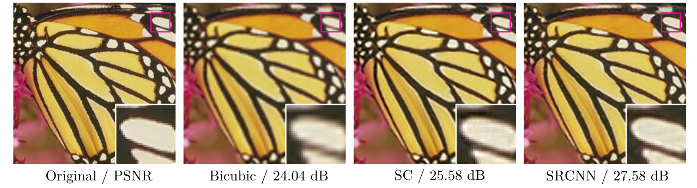

# SRCNN

# Introduction

It is a re-implementation of paper named ["Learning a Deep Convolutional Network forImage Super-Resolution"](http://personal.ie.cuhk.edu.hk/~ccloy/files/eccv_2014_deepresolution.pdf) called SRCNN model. Training codes and applying codes are provided based tensorflow.

## Network proposed

The LR input is firstly bicubic interpolated into a HR-sized image, then normal feature extraction, mapping and reconstruction are used. The network here is aimed at learning the mapping relationship between bicubic interpolated image and real image.

## Analysis of Network

As the table shows below, it is bicubic-interpolation used too much resources that limits the time performance of this model.

# Methods of Interpolation

## Bilinear Interpolation

Bilinear interpolation produces a smoother interpolation than does the nearest neighbor approach. Given four neighboring image coordinates
$$
f(n_{10},n_{20}),f(n_{11},n_{21}),f(n_{12},n_{22}),f(n_{13},n_{23})
$$
(these can be the four nearest neighbors of $f[a(n)])$, then the geometrically transformed image $g(n1, n2)$ is computed as
$$
g(n_1,n_2)=A_0+A_1n_1++A_2n_2++A_3n_1n_2
$$
which is a bilinear function in the coordinates $(n1, n2)$. The bilinear weights $A_0$, $A_1$, $A_2$, and $A_3$ are found by solving
$$
\begin{bmatrix}
   A_0 \\
   A_1 \\
   A_2 \\
   A_3
  \end{bmatrix} =
  \begin{bmatrix}
   1 & n_{10} & n_{20} & n_{10}n_{20} \\
   1 & n_{11} & n_{21} & n_{11}n_{21} \\
   1 & n_{12} & n_{22} & n_{12}n_{22} \\
   1 & n_{13} & n_{23} & n_{13}n_{23}
  \end{bmatrix} ^{-1}
  \begin{bmatrix}
   f(n_{10},n_{20}) \\
   f(n_{11},n_{21}) \\
   f(n_{12},n_{22}) \\
   f(n_{13},n_{23})
  \end{bmatrix}
$$
Thus, $g(n1, n2)$ is defined to be a linear combination of the gray levels of its four nearest neighbors. The linear combination defined by above is in fact the value assigned to $g(n1, n2)$ when the best (least squares) planar fit is made to these four neighbors. This process of optimal averaging produces a visually smoother result.

## Bicubic Interpolation

Bicubic Interpolation can be calculated by below
$$
f(x,y)=a_{00}+a_{10}x+a_{01}y+a_{11}xy+a_{02}y^2+a_{21}x^2y+a_{12}xy^2+a_{22}x^2y^2+a_{30}x^3+a_{03}y^3+a_{31}x^3y+a_{13}xy^3+a_{32}x^3y^2+a_{23}x^2y^3+a_{33}x^3y^3
$$

This formula can be written by another form
$$
f(x,y)=\sum_{i,j=0}^3a_{ij}x^iy^j
$$
Since there are 16 parameters in the formula, the calculation of Bicubic Interpolation relays on the surrounding 16 values of points. It means we need to do 16-dimensional matrix operations at least once per pixel. **The calculation of parameters** and **interpolation** of pixels are essential.

**Step 1: The calculation of parameters**
$$
A=Var^{-1}f(x,y)
$$
**Step 2: The interpolation**
$$
f(x,y)=Var·A
$$
where $A$ stands for parameters, $Var$ stands for the variables in formulas ($x^iy^j$), $f(x,y)$ represents the value of points surrounding.

# Results

After 50 epoches, the model performs not bad on train data.

The SRCNN has a better result than traditional method about SR problem, as the Figure shows below (original from paper).

# Author

Wenkang Zhu

If you have or find any problems, this is my email: [wenkang_zhu@whu.edu.cn](mailto:wenkang_zhu@whu.edu.cn). And I'm glad to reply it.
Thanks. 

# Reference
1. https://www.sciencedirect.com/topics/computer-science/bilinear-interpolation
2. https://wikimili.com/en/Bicubic_interpolation
3. [双三次插值](./SRCNN/BicubicInterpolation.pdf)

