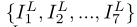

# TGA

# 介绍

​		超分辨率旨在通过填充缺失的细节，从相应的低分辨率图像中产生高分辨率图像。对于单幅图像的超分辨率，通过探索图像中的自然图像先验和自相似性来估计高分辨率图像。对于视频超分辨率，跨位置的空间信息和跨帧的时间信息都可以用于增强LR帧的细节。

> Super-resolution aims at producing high-resolution (HR) images from the corresponding low-resolution (LR) ones by filling in missing details. For single image super-resolution, an HR image is estimated by exploring natural image priors and self-similarity within the image. For video super- resolution, both spatial information across positions and temporal information across frames can be used to enhance details for an LR frame. 

​		大多数视频超分辨率方法采用以下流水线:运动估计、运动补偿、融合和上采样。它们以离线或在线的方式估计参考帧和其他帧之间的光流，然后将所有其他帧与具有后向扭曲的参考帧对齐。然而，这对于视频超分来说不是最佳的。具有显式运动补偿的方法严重依赖于运动估计的准确性。不准确的运动估计和对准，尤其是当存在遮挡或复杂运动时，会导致失真和误差，从而降低最终的超分辨率性能。此外，诸如光流之类的每像素运动估计经常遭受沉重的计算负荷。

> Most video super-resolution methods adopt the following pipeline: motion estimation, motion compensation, fusion and upsampling. They estimate optical flow between a reference frame and other frames in either an offline or online manner, and then align all other frames to the reference with backward warping. However, this is not optimal for video SR. Methods with explicit motion compen- sation rely heavily on the accuracy of motion estimation. In- accurate motion estimation and alignment, especially when there is occlusion or complex motion, results in distortion and errors, deteriorating the final super-resolution perfor- mance. Besides, per-pixel motion estimation such as optical flow often suffers a heavy computational load.

​		Jo所提出的DUF方法通过动态上采样滤波器隐含地利用LR帧之间的运动信息来恢复HR帧。它受运动估计精度的影响较小，但其性能受到动态上采样滤波器大小的限制。此外，从其他帧到参考帧的时间信息集成过程是在没有明确考虑参考帧的情况下进行的。这导致了对输入序列中边界帧的无效信息整合。

> Recently Jo proposed the DUF method which implicitly utilizes motion information among LR frames to recover HR frames by means of dynamic upsampling filters. It is less influenced by the accuracy of motion estimation but its performance is limited by the size of the dynamic upsampling filters. In
> addition, the temporal information integration process from other frames to the reference frame is conducted without explicitly taking the reference frame into consideration. This leads to ineffective information integration for border frames in an input sequence.

​		在这项工作中，我们提出了一种新的深度神经网络，它以隐含的方式分层利用运动信息，并能够充分利用帧间的互补信息来恢复参考帧中丢失的细节。我们建议将一个序列分成几个组，以**分层**的方式进行信息整合，即首先整合每组中的信息，然后整合跨组的信息，而不是用光流将所有其他帧与参考帧对齐或对整个序列应用3D卷积。所提出的分组方法产生具有不同帧速率的子序列组，这些子序列组为参考帧提供不同种类的补充信息。这种不同的互补信息用关注模块建模，并且这些组与**3D密集块（3D Dense Block)**和**2D密集块(2D Dense Block)**深度融合，以生成参考帧的高分辨率版本。总的来说，所提出的方法遵循分层方式。它能够处理各种类型的运动，并自适应地从不同帧速率的组中借用信息。

# 网络架构

## Overview

​		给定一个连续低分辨率视频帧序列由参考帧和相邻帧组成，其目标是充分利用序列中的时空信息来重构参考帧的高分辨率版本。所提出方法的总体流程如图2所示。它是一个通用框架，适用于处理不同输入长度的序列。以7帧为例，我们将中间帧表示为参考帧，其他帧表示为相邻帧。根据运动解耦，将输入的7帧图像分成三组，每组代表一定的帧速率。提出了一种共享权值的组内融合模块，用于提取和融合各组内的时空信息。通过基于注意力的组间融合模块，进一步整合跨组信息。最后，通过添加网络生成的残差图和输入参考帧的双三次上采样生成输出高分辨率帧。此外，还提出了一个快速空间对齐模块，以进一步帮助处理大运动视频序列。

## Temporal Group Attention

### Temporal Grouping

​		相邻的2N帧根据到参考帧的时间距离被分成N个组。原始序列被重新排序为其中是由前一帧参考帧和后一帧组成的子序列。

​		这种分组使得具有不同时间距离的相邻帧能够显式高效地进行整合，原因有两个：

1. 不同时间距离的相邻帧的贡献不相等，特别是对于具有大变形、遮挡和运动模糊的帧。当一个组中的一个区域是（例如通过遮挡），丢失的信息可以由其他组恢复。也就是说，不同群体的信息是互补的。

2. 每个组中的参考帧引导模型从相邻帧中提取有益的信息，从而实现高效的信息提取和融合。

### Intra-group Fusion

​		该模块由三部分组成。第一部分包含三个单元作为空间特征抽取器，每个单元由一个3×3的卷积层和一个批归一化（BN）和ReLU组成。所有的卷积层都配备了**膨胀率**来模拟与一个与组相关的运动水平。第二部分中，使用*3×3×3*核的三维卷积层进行时空特征融合。最后，通过在**2D密集块**中应用18个2D单元来深度整合每个组内的信息，生成组级特征。为了提高效率，组内融合模块的权重被共享给每个组。

### Inter-group Fusion with Temporal Attention

​		为了更好地整合不同群体的特征，引入了一个时间注意模块。

​		对于每一组，在相应的特征映射上加上一个*3×3*的卷积层，计算一个单通道特征映射。接着应用***softmax*****函数**计算注意力*Mask*。

​		将特征映射与Mask逐元素相乘得到分组特征。

​		组间融合模块的目标是聚合跨不同时间组的信息并生成高分辨率残差图。为了在时间组上充分利用注意力加权特征，我们首先通过沿时间轴将特征进行串联来汇总这些特征，并将其馈入**3D密集块**中。然后，将**2D密集块**放在顶部以进行进一步融合，如图4所示。3D单元具有与组内融合模块中使用的2D单元相同的结构。将具有*1×3×3*内核的卷积层插入3D密集块的末尾以减少通道。

​		最后，类似于几种单图像超分辨率方法，使用深度空间操作对充分聚集的特征进行上采样，以生成高分辨率残差图。残差图和三次三次上采样参考图像加和得到高分辨率重建。

# 结果

我们采用Vimeo-90k作为训练集，从高分辨率视频剪辑中抽取空间分辨率为*256×256*的图片。通过应用标准差σ = 1.6的高斯模糊和四倍下采样来生成64×64的低分辨率图片。

# 作者

[贺程杰](https://github.com/FatShan)

如果你有问题，欢迎联系我。我的邮箱是：[2733096939@qq.com](mailto:2733096939@qq.com)，乐意回复。

谢谢。

# 参考文献

1. [Video super resolution with temporal group attention.pdf](https://openaccess.thecvf.com/content_CVPR_2020/papers/Isobe_Video_Super-Resolution_With_Temporal_Group_Attention_CVPR_2020_paper.pdf)

2. [论文本地链接](./TGA/2020-TGA Video super resolution with temporal group attention.pdf)
