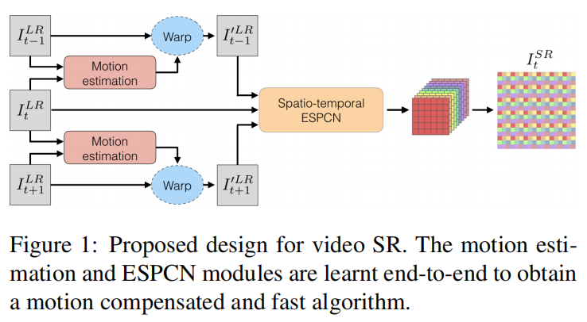
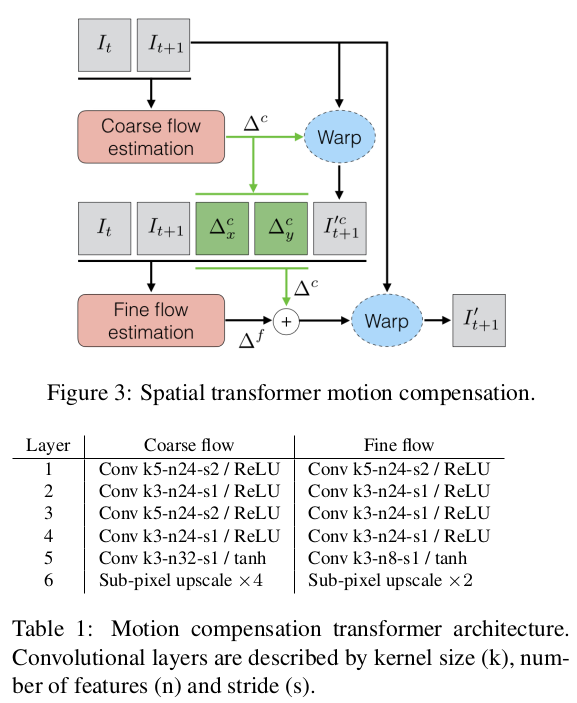
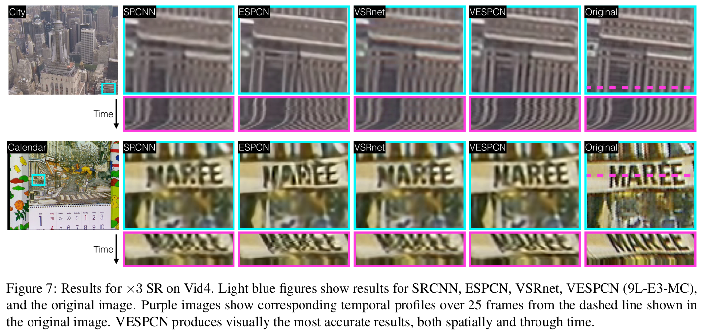

# VESPCN

# 介绍

这是对论文《[Real-Time Video Super-Resolution with Spatio-Temporal Networks and Motion Compensation](./VESPCN/2017-Real time video super resolution with spatio-temporal networks and motion compensation.pdf)》的复现，论文中提出的网络被称为`VESPCN`，`spatio-temporal sub-pixel convolution networks（时空子像素卷积网络）`，代码使用TensorFlow实现。

# 网络架构

## 提出的网络

1. 提出了`时空子像素卷积网络`，可以在维持实时速度的同时有效利用时间冗余并且提升重建准确率
2. 讨论了`early fusion`，`slow fusion`和`3D fusion`用于连续视频帧的联合处理
3. 提出了一种全新的`联合运动补偿（joint motion compensation）`和`视频超分（VSR）`算法

## 空间变换网络 STN

https://blog.csdn.net/qq_39422642/article/details/78870629

## 光流法

考虑一个像素`I(x,y,t)`用了`dt`时间到达下一帧`I(x+dx,y+dy,t+dt)`，用一阶泰勒展开得到：
$$
I(x+dx,y+dy,t+dt)=I(x,y,t)+\frac{\delta I}{\delta x}dx+\frac{\delta I}{\delta y}dy+\frac{\delta I}{\delta t}dt+\zeta
$$
两边对`t`求导，得到：
$$
\frac{\delta I}{\delta x}\frac{dx}{dt}+\frac{\delta I}{\delta y}\frac{dy}{dt}+\frac{\delta I}{\delta t}\frac{dt}{dt}=0
$$
令
$$
u=\frac{dx}{dt},v=\frac{dy}{dt},I_x=\frac{dI}{dx},I_y=\frac{dI}{dy},I_t=\frac{dI}{dt}
$$
上式可以写成：
$$
I_xu+I_yv+I_t=0
$$
这个方程中，`Ix,Iy,It`可以由图像计算出，`(u,v)`即为该像素点的光流矢量。因为目前仅有一个方程，但有两个未知数，所以还要引入其他约束条件，此处不再展开。

## 网络分析

`VESPCN`从其设计思想看是运用邻近帧（前一帧和后一帧）之间的信息，将前后帧对应到当前帧之后，拼接成一个9通道的矩阵作为ESPCN超分网络的输入。`VESPCN`可以分为2个部分，**三帧对齐**和**图像重建**。

**三帧对齐**部分借鉴了[光流法](https://blog.csdn.net/qq_41368247/article/details/82562165)和[STN(Spatial Transform Networks)](https://blog.csdn.net/qq_39422642/article/details/78870629)，分别构建了光流估计网络和空间变换网络。光流估计网络对应`Motion estimation`模块，而`STN`对应`Warp`模块，前者用来估计帧间的运动，后者用来运动补偿。

**图像重建**部分采用`ESPCN`网络，这里的输入是3张图片的9个通道。

# 结果

如下图所示（摘自paper），

# 作者

朱文康

如果你有问题，欢迎联系我。我的邮箱是：[wenkang_zhu@whu.edu.cn](mailto:wenkang_zhu@whu.edu.cn)，乐意回复。

谢谢。

# 参考文献

- https://www.pianshen.com/article/17201609448/
- [学习笔记之——基于深度学习的图像超分辨率重建](https://blog.csdn.net/gwplovekimi/article/details/83041627?utm_medium=distribute.pc_relevant_download.none-task-blog-baidujs-8.nonecase&depth_1-utm_source=distribute.pc_relevant_download.none-task-blog-baidujs-8.nonecase#ESPCN%EF%BC%88Efficient%20Sub-Pixel%20Convolutional%20Neural%20Network%EF%BC%89)
- [计算机视觉--光流法(optical flow)简介](https://blog.csdn.net/qq_41368247/article/details/82562165)